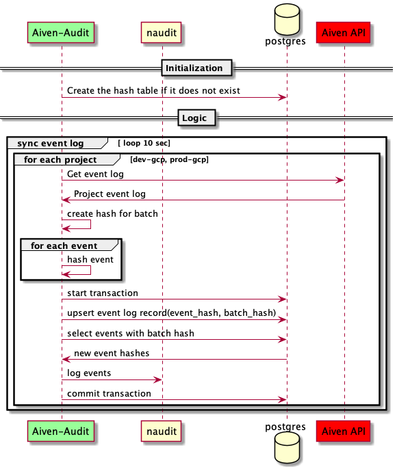

# Aiven Audit (Go) 📝🕵️
Transfers project event logs from Aiven API to ArcSight

## TODO
- [ ] Impl connect to Aiven API and get logs
- [ ] Impl connect to db and upsert logs
- [ ] Impl connect to ArcSight and sync logs

## How Aiven Audit works

## Sync loop
0. hash batch
1. Hash message
2. upsert with hash as prim key, and with batch hash as column
3. Fetch rows with batch in question
4. Publish to Arcsight